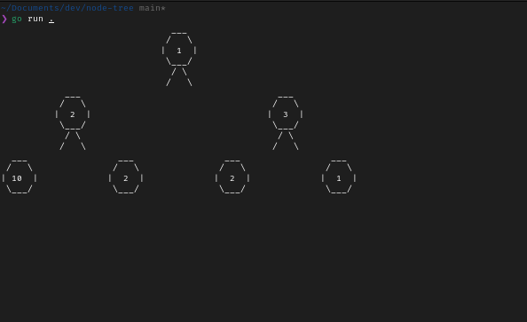

#  ASCII Binary Tree Visualizer (Go)

A lightweight command-line tool that prints **binary trees as ASCII art**, complete with circle-shaped nodes and smooth diagonal branches — all rendered efficiently using Go’s `bytes.Buffer`.



---

##  Features

*  Draws **binary trees** using ASCII characters
*  Nodes displayed as **rounded circles** (using `/`, `|`, and `\`)
*  Smooth diagonal **connectors** that touch each node perfectly
*  Uses **buffered output** for efficient rendering
*  Fully configurable node width, spacing, and tree layout

---

##  Example Output

```
      ___
     /   \
    | 1 |
     \___/
     /   \
    /     \
 ___       ___
/   \     /   \
| 2 |     | 3 |
\___/     \___/
          /   \
         /     \
      ___       ___
     /   \     /   \
    | 2   |   | 1  |
     \___/     \___/
```

---

##  How It Works

* Each node is drawn as a **multi-line ASCII circle** using `/`, `|`, `\`, and `_`.
* The program computes each node’s **x/y position** recursively using in-order traversal.
* The tree is stored in memory, and connections between nodes are drawn with **proportionally spaced diagonal lines**.
* Finally, all lines are written into a **byte buffer**, trimmed, and printed efficiently.

---

## ️ Configuration

You can tweak rendering options directly in the code:

| Variable    | Description                           | Default |
| ----------- | ------------------------------------- | ------- |
| `nodeWidth` | Width of each node’s ASCII circle     | `7`     |
| `gap`       | Horizontal spacing between nodes      | `2`     |
| `depthGap`  | Vertical distance between tree levels | `4`     |

---

## 🧪 Example Usage

### Run

```bash
go run main.go
```

### Sample Output Tree

The program uses a small demo tree:

```go
func sampleTree() *node {
	return &node{
		val: "1",
		left: &node{
			val: "2",
		},
		right: &node{
			val:   "3",
			left:  &node{val: "2"},
			right: &node{val: "1"},
		},
	}
}
```

You can modify this to render your own custom trees.
---

